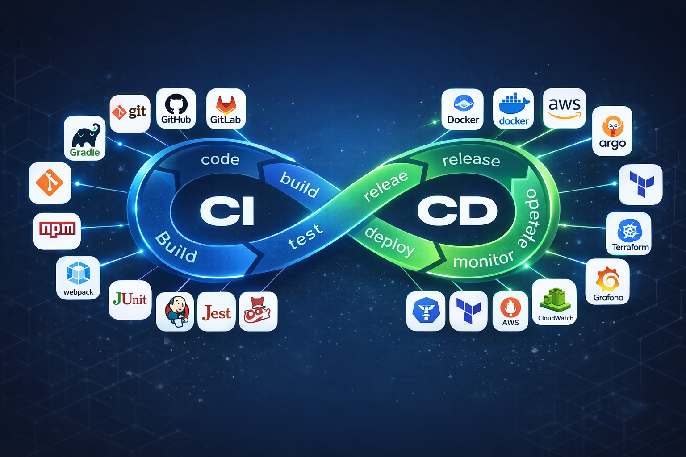

  

# Hi, I'm Vaibhav Sudhakar Ingle 👋

🚀 **AWS DevOps Engineer (Fresher)** with hands-on experience in designing, automating, and deploying cloud infrastructure using AWS, CI/CD pipelines, containerization, Kubernetes (EKS), and Infrastructure as Code. Focused on building scalable, secure, and production-ready DevOps solutions.

---

## 🧠 Core Skills
- **AWS**: EC2, S3, IAM, VPC, ALB, Auto Scaling, ECS, ECR, RDS, Route 53, CloudWatch
- **CI/CD**: Jenkins, GitHub Actions, AWS CodePipeline, CodeBuild, CodeDeploy
- **Containers**: Docker, Kubernetes (EKS), Helm
- **Infrastructure as Code**: Terraform, Ansible
- **DevSecOps & Monitoring**: SonarQube, Trivy, CloudWatch
- **OS**: Linux (Ubuntu)

---

## 📌 Featured Projects
- **AWS CI/CD Pipeline – 3 Tier Deployment**
- **Terraform-based Three-Tier Application on AWS**
- **2048 Game Deployment on Docker & Kubernetes (EKS)**

---

## 📫 Connect with Me
- 📧 Email: inglevaibhav667@gmail.com  
- 🔗 LinkedIn: https://www.linkedin.com/in/your-link
